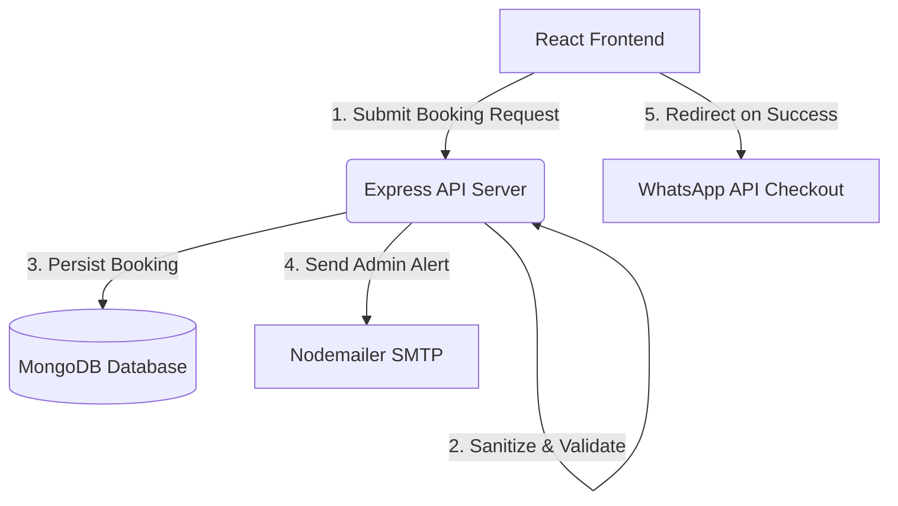

# 🚖 Parichaya Tours & Travels

A premium, production-grade MERN stack web application built for **Parichaya Tours & Travels**. This repository features a fully responsive React SPA frontend powered by Vite, Tailwind CSS, Leaflet Maps, and Framer Motion, coupled with a secured Node.js/Express backend integrated with MongoDB and Nodemailer.

[](https://parichaya-tours.netlify.app)
[](https://react.dev)
[](https://expressjs.com)

---

## 📖 Table of Contents
- [✨ Key Features](#-key-features)
- [🏗️ System Architecture](#️-system-architecture)
- [📁 Repository Structure](#-repository-structure)
- [⚙️ Setup & Installation](#️-setup--installation)
  - [1. Backend Setup](#1-backend-setup)
  - [2. Frontend Setup](#2-frontend-setup)
- [🔌 API Documentation](#-api-documentation)
- [🛡️ Security Hardening](#️-security-hardening)
- [🚀 Deployment](#-deployment)
- [🤖 Sub-Projects (Robotic Manipulation)](#-sub-projects-robotic-manipulation)

---

## ✨ Key Features

### 💻 Frontend (React + Vite + Tailwind CSS)
*   **Booking Widget:** Interactive four-tab reservation interface:
    *   **Outstation:** Round-trip fare estimation dynamically calculated via OpenStreetMap routing.
    *   **Local Packages:** Fixed-duration packages (4 Hrs / 40 KM, 80 KM) with upfront vehicle rates.
    *   **Airport Transfers:** Drop-off and pickup options to/from Kempegowda International Airport.
    *   **Rental / Self-Drive:** Transparent flat-rate booking widget (₹799/6 hours + extra-hour increments).
*   **Dynamic OpenStreetMap Picker:** In-app custom `LocationPicker` component using `leaflet` and `react-leaflet` for visual address selection and route parsing (via OpenStreetMap Nominatim APIs).
*   **WhatsApp Reservation Dispatch:** Instant checkout triggers a beautifully formatted WhatsApp text containing booking metadata directly to the agency's hotline.
*   **Floating & Sticky Navigation:** Blinking floating WhatsApp support triggers for desktop viewports, and custom thumb-friendly high-target mobile action bars (Call/WhatsApp/Book).
*   **Page Routing & SEO:** Modern client-side routing using `react-router-dom` with standard pages (About, Services, Contact, Terms & Conditions, Privacy Policy, Disclaimer).

### ⚙️ Backend (Express + Node.js + MongoDB)
*   **Automated Email Dispatcher:** Direct integration with `nodemailer` to dispatch instant administrative email alerts upon booking creations or contact form submissions.
*   **Data Models:** Sanitized Mongoose validation models (`Booking`, `Contact`) that enforce schema safety.
*   **Admin Dashboard Controller:** Secured admin endpoint queries (`GET /api/bookings`) authenticated via custom security header signatures (`x-admin-password`).

---

## 🏗️ System Architecture



---

## 📁 Repository Structure

```text
├── backend/                       # Express Node.js Server
│   ├── models/                    # Mongoose Database Schemas
│   │   ├── Booking.js             # Booking database records
│   │   └── Contact.js             # Contact messages records
│   ├── routes/                    # API Endpoints
│   │   └── api.js                 # Unified Router (bookings, contact, admin fetch)
│   ├── .env                       # Backend Environment Variables (git-ignored)
│   ├── package.json               # Backend Node scripts & dependencies
│   └── server.js                  # Main server entrypoint
│
├── frontend/                      # React SPA Client (Vite)
│   ├── src/
│   │   ├── components/            # Reusable React components (Header, LocationPicker, etc.)
│   │   ├── pages/                 # Routing Pages (Home, Admin, Contact, Legal documents)
│   │   ├── config.js              # Environment variable parser & fallback configurations
│   │   ├── App.jsx                # Main Application Layout & Client Routes
│   │   └── main.jsx               # React DOM Target Bootstrapper
│   ├── vercel.json                # Vercel Deployment configuration file
│   └── package.json               # Frontend Node scripts & dependencies
│
└── robotic_manipulation/          # Experimental Python-based Sub-project (Simulation & Evaluation)
```

---

## ⚙️ Setup & Installation

### Prerequisites
*   [Node.js](https://nodejs.org/) (v18.x or above recommended)
*   [MongoDB](https://www.mongodb.com/) (Local server or Atlas URI connection)

---

### 1. Backend Setup

1.  Navigate to the backend directory:
    ```bash
    cd backend
    ```
2.  Install dependencies:
    ```bash
    npm install
    ```
3.  Create a `.env` file in the `backend/` directory:
    ```ini
    PORT=5000
    MONGODB_URI=mongodb://localhost:27017/parichaya
    EMAIL_USER=your_gmail@example.com
    EMAIL_PASS=your_gmail_app_password
    ADMIN_PASSWORD=your_secure_admin_panel_password
    ```
4.  Start the backend development server:
    ```bash
    node server.js
    ```
    *Note: The server will boot on port `5000` (or your configured `PORT` variable).*

---

### 2. Frontend Setup

1.  Navigate to the frontend directory:
    ```bash
    cd ../frontend
    ```
2.  Install dependencies:
    ```bash
    npm install
    ```
3.  Create a `.env` file in the `frontend/` directory:
    ```ini
    VITE_API_URL=http://localhost:5000/api
    VITE_CONTACT_PHONE=+919916625306
    VITE_CONTACT_PHONE_DISPLAY=+91 9916625306
    VITE_WHATSAPP_PHONE=918073183863
    VITE_CONTACT_EMAIL=parichayatoursandtravels@gmail.com
    ```
4.  Run the Vite development server:
    ```bash
    npm run dev
    ```
    *Note: The application will typically start running on `http://localhost:5173`.*

---

## 🔌 API Documentation

All endpoints are prefixed with `/api`.

### 🚖 Bookings
*   **Create Booking**
    *   **Endpoint:** `POST /booking`
    *   **Security:** Rate-limited (5 requests / 15 minutes per IP)
    *   **Body Parameters:**
        ```json
        {
          "type": "outstation | local | airport | rental",
          "contactName": "John Doe",
          "contactPhone": "+919999988888",
          "date": "2026-06-12",
          "time": "14:30",
          "from": "Pickup Address",
          "to": "Drop Address",
          "vehicle": "5-Seater",
          "tripType": "round-trip",
          "package": "80 KM",
          "hours": 6,
          "totalFare": 999
        }
        ```
    *   **Response (201 Created):**
        ```json
        {
          "success": true,
          "booking": { ... }
        }
        ```

*   **Fetch Bookings (Admin)**
    *   **Endpoint:** `GET /bookings`
    *   **Required Header:** `x-admin-password: YOUR_CONFIGURED_ADMIN_PASSWORD`
    *   **Response (200 OK):**
        ```json
        {
          "success": true,
          "bookings": [ ... ]
        }
        ```

---

### ✉️ Contact Form
*   **Submit Inquiry**
    *   **Endpoint:** `POST /contact`
    *   **Security:** Rate-limited (5 requests / 15 minutes per IP)
    *   **Body Parameters:**
        ```json
        {
          "name": "Jane Doe",
          "phone": "+918888877777",
          "email": "jane@example.com",
          "message": "Custom travel itinerary inquiry..."
        }
        ```
    *   **Response (201 Created):**
        ```json
        {
          "success": true,
          "contact": { ... }
        }
        ```

---

## 🛡️ Security Hardening

To address security audits, the MERN ecosystem features:
*   **Security Headers:** `helmet` configuration active, with restricted Content Security Policy (CSP) allowing only trusted map servers (OpenStreetMap, Nominatim) and WhatsApp click-to-chat widgets.
*   **Rate Limiting:** IP-based request throttler (`express-rate-limit`) preventing spam on form submissions.
*   **Input Sanitization:** HTML tag removal regex and custom sanitization helpers blocking XSS and NoSQL injection attempts.
*   **Admin Access Gate:** Header-based custom secret checks for internal bookings read routes.

---

## 🚀 Deployment

### Deplay Frontend (Vercel / Netlify)
*   **SPA Redirect Rule:** For HTML5 history mode routing (refreshing `/about` without hitting a 404), configure a rewrite rule.
    *   *Netlify:* Place a `_redirects` file under `public/` containing: `/* /index.html 200`
    *   *Vercel:* Provided in the repository's root `vercel.json` rewrite file.
*   **API URL binding:** Make sure to bind your deployed server route URL to the frontend environment variable `VITE_API_URL` during build.

### Deploy Backend
*   Deploy the `backend` folder on a cloud platform (e.g. Render, Railway, AWS EC2).
*   Add environment configuration variables on the hosting platform and hook up a live MongoDB Atlas Database instances URI.
*   Update CORS config in `server.js` to point only to your custom deployed Netlify/Vercel domains.

---

## 🤖 Sub-Projects (Robotic Manipulation)
Under the `/robotic_manipulation` directory, there is a separate experimental python setup consisting of:
*   **`main.py`** and **`simulation/`** utilities.
*   **`configs/`** and **`evaluation/`** scripts.
To configure and run the simulation, run:
```bash
cd robotic_manipulation
pip install -r requirements.txt
python main.py
```
